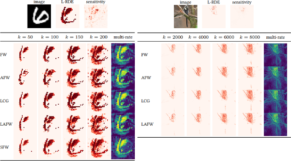

# Interpretable Neural Networks with Frank-Wolfe: Sparse Relevance Maps and Relevance Orderings

[](https://github.com/ZIB-IOL/fw-rde/blob/master/LICENSE)
[](https://doi.org/10.5281/zenodo.5718781)
[](https://www.julialang.org/)
[](https://www.python.org/)
[](https://tensorflow.org/)

This repository provides the official implementation of the paper [Interpretable Neural Networks with Frank-Wolfe: Sparse Relevance Maps and Relevance Orderings](https://arxiv.org/abs/2110.08105) by J. Macdonald, M. Besançon and S. Pokutta (2021).

**TL;DR:** We use a constrained optimization formulation of the [Rate-Distortion Explanations (RDE)](https://arxiv.org/abs/1905.11092) (Macdonald et al., 2019) method for relevance attribution and Frank-Wolfe algorithms for obtaining interpretable neural network predictions.



## Content

This repository contains subfolders with code for two independent experimental scenarios.

- [`mnist`](mnist) : Sparse relevance maps (relevance attribution) and relevance orderings for a relatively small LeNet-inspired neural network classifier on the MNIST dataset of greyscale images of handwritten digits.

- [`stl10`](stl10) : Sparse relevance maps (relevance attribution) for a larger VGG-16 based neural network classifier on the STL-10 dataset of color images.


## Requirements & Setup

The package versions we used are specified in [`Project.toml`](Project.toml), [`Manifest.toml`](Manifest.toml), and [`setup.jl`](setup.jl).  
To reproduce our computational environment run:

```console
julia setup.jl
```

To test the installation run:
```console
test_installation.jl
```

This should print all the installed `Julia` and `Python` packages.

## Usage

The script [`rde.jl`](rde.jl) can be used to obtain **sparse** relevance mappings.

The script [`rde_birkhoff.jl`](rde_birkhoff.jl) can be used to obtain relevance **orderings** with **deterministic** Frank-Wolfe algorithms.

The script [`rde_birkhoff_stochastic.jl`](rde_birkhoff_stochastic.jl) can be used to obtain relevance **orderings** with **stochastic** Frank-Wolfe algorithms.

## License

This repository is MIT licensed, as found in the [LICENSE](LICENSE) file.
